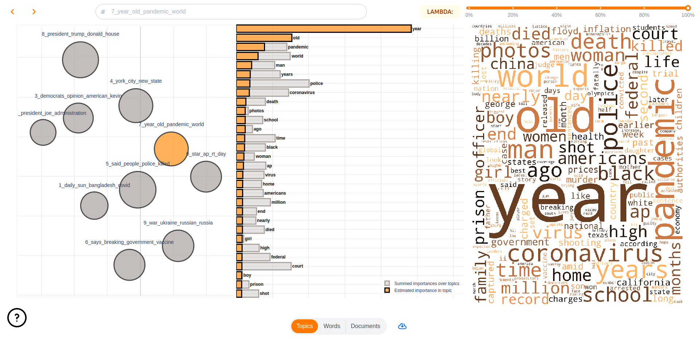
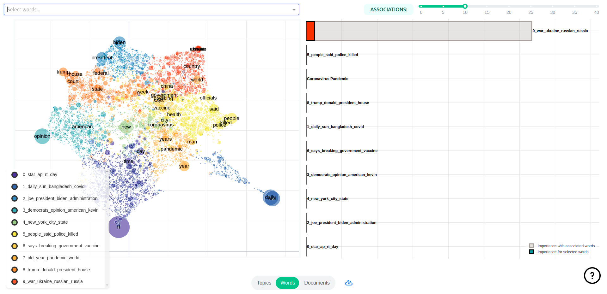
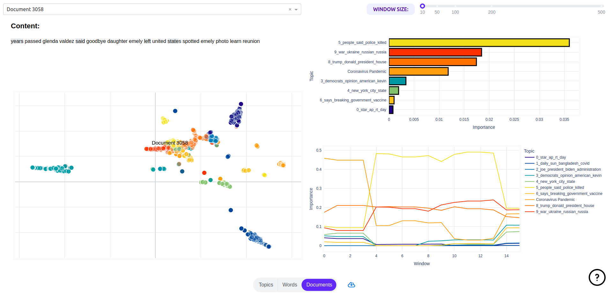
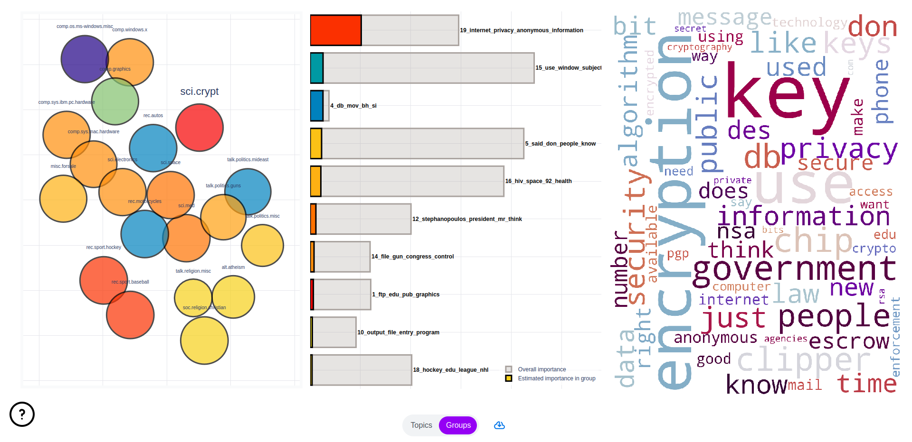
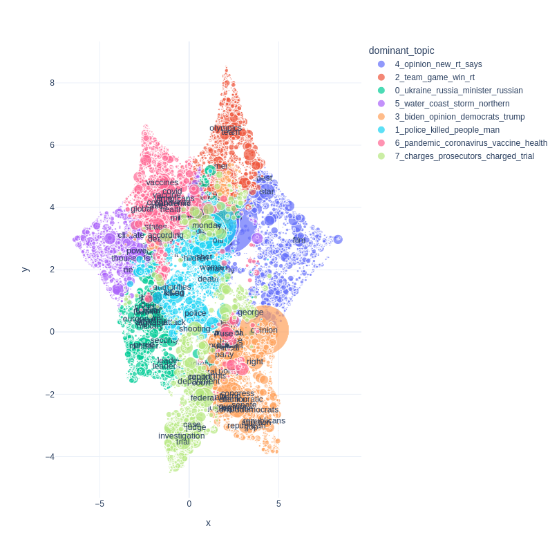
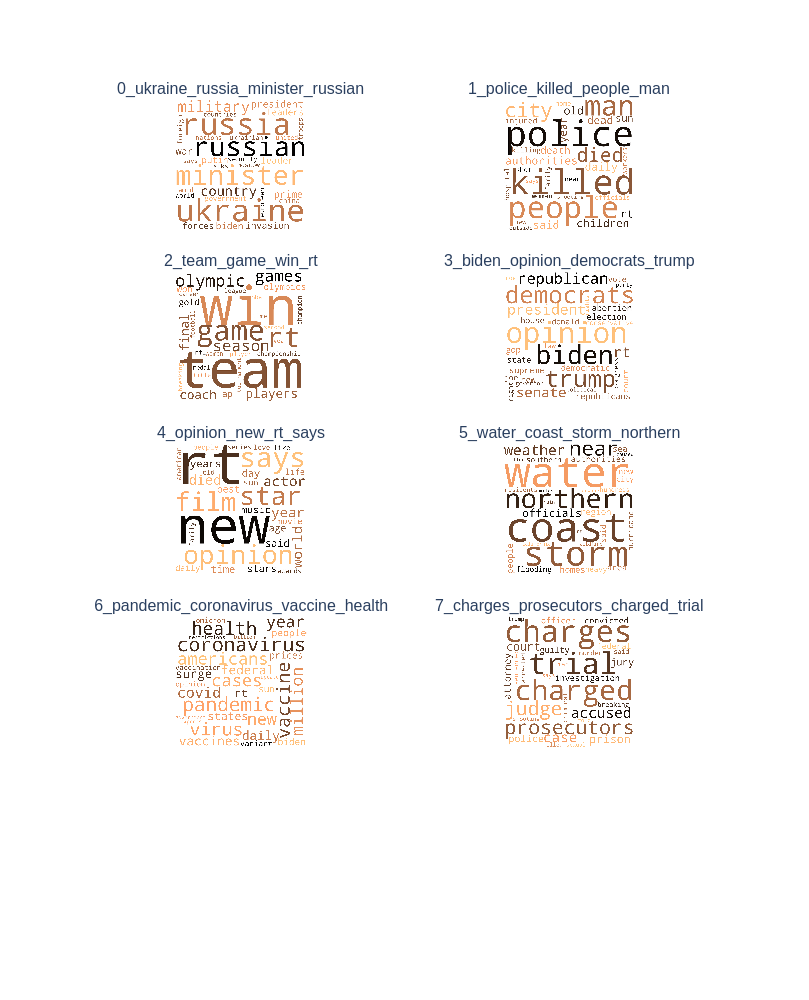

# topicwizard

<br>

Pretty and opinionated topic model visualization in Python.

[](https://colab.research.google.com/github/x-tabdeveloping/topic-wizard/blob/main/examples/basic_usage.ipynb)
[](https://pypi.org/project/topic-wizard/)
[](https://pypi.org/project/topic-wizard/)
[](https://github.com/centre-for-humanities-computing/tweetopic)
[](https://black.readthedocs.io/en/stable/the_black_code_style/current_style.html)
<br>


https://github.com/x-tabdeveloping/topicwizard/assets/13087737/9736f33c-6865-4ed4-bc17-d8e6369bda80


## New in version 0.5.0 🌟 

- Enhanced readibility and legibility of graphs.
- Added helper tooltips to help you understand and interpret the graphs.
- Improved stability.
- Negative topic distributions are now supported in documents.

## Features

-   Investigate complex relations between topics, words, documents and groups/genres/labels
-   Easy to use pipelines that can be utilized for downstream tasks
-   Sklearn, Gensim and BERTopic compatible :nut_and_bolt:
-   Highly interactive web app
-   Interactive and composable Plotly figures
-   Automatically infer topic names, oooor...
-   Name topics manually
-   Easy deployment :earth_africa:

## Installation

Install from PyPI:

```bash
pip install topic-wizard
```

## [Pipelines](https://x-tabdeveloping.github.io/topicwizard/usage.pipelines.html)

The main abstraction of topicwizard around a topic model is a topic pipeline, which consists of a vectorizer, that turns texts into bag-of-tokens
representations and a topic model which decomposes these representations into vectors of topic importance.
topicwizard allows you to use both scikit-learn pipelines or its own `TopicPipeline`.


Let's build a pipeline. We will use scikit-learns CountVectorizer as our vectorizer component:
```python
from sklearn.feature_extraction.text import CountVectorizer

vectorizer = CountVectorizer(min_df=5, max_df=0.8, stop_words="english")
```
The topic model I will use for this example is Non-negative Matrix Factorization as it is fast and usually finds good topics.
```python
from sklearn.decomposition import NMF

model = NMF(n_components=10)
```
Then let's put this all together in a pipeline. You can either use sklearn Pipelines...
```python
from sklearn.pipeline import make_pipeline

topic_pipeline = make_pipeline(vectorizer, model)
```
Or TopicPipeline from topicwizard:
```python
from topicwizard.pipeline import make_topic_pipeline

topic_pipeline = make_topic_pipeline(vectorizer, model, norm_rows=False)
```

Let's load a corpus that we would like to analyze, in this example I will use 20newsgroups from sklearn.

```python
from sklearn.datasets import fetch_20newsgroups

newsgroups = fetch_20newsgroups(subset="all")
corpus = newsgroups.data

# Sklearn gives the labels back as integers, we have to map them back to
# the actual textual label.
group_labels = [newsgroups.target_names[label] for label in newsgroups.target]
```

Then let's fit our pipeline to this data:
```python
topic_pipeline.fit(corpus)
```
The advantages of using a TopicPipeline over a regular pipeline are numerous:
 - Output dimensions (topics) are named
 - You can set the output to be a pandas dataframe (`topic_pipeline.set_output(transform="pandas")`) with topics as columns.
 - You can treat topic importances as pseudoprobability-distributions (`topic_pipeline.norm_row = True`)
 - You can freeze components so that the pipeline will stay frozen when fitting downstream components (`topic_pipeline.freeze = True`)

Here's an example of how you can easily display a heatmap over topics in a document using TopicPipelines.
```python
import plotly.express as px

pipeline = make_topic_pipeline(vectorizer, model).set_output(transform="pandas")
texts = [
   "Coronavirus killed 50000 people today.",
   "Donald Trump's presidential campaing is going very well",
   "Protests against police brutality have been going on all around the US.",
]
topic_df = pipeline.transform(texts)
topic_df.index = texts
px.imshow(topic_df).show()
```


You didn't even have to use topicwizards own visualizations for this!!

You can also use TopicPipelines for downstream tasks, such as unsupervised text labeling with the help of [human-learn](https://github.com/koaning/human-learn).
```bash
pip install human-learn
```
```python
from hulearn.classification import FunctionClassifier
from sklearn.pipeline import make_pipeline

topic_pipeline = make_topic_pipeline(vectorizer, model).fit(texts)

# Investigate topics
topicwizard.visualize(topic_pipeline)

# Creating rule for classifying something as a corona document
def corona_rule(df, threshold=0.5):
    is_about_corona = df["11_vaccine_pandemic_virus_coronavirus"] > threshold
    return is_about_corona.astype(int)

# Freezing topic pipeline
topic_pipeline.freeze = True
classifier = FunctionClassifier(corona_rule)
cls_pipeline = make_pipeline(topic_pipeline, classifier)
```

## [Web Application](https://x-tabdeveloping.github.io/topicwizard/application.html)

You can launch the topic wizard web application for interactively investigating your topic models. The app is also quite easy to [deploy](https://x-tabdeveloping.github.io/topicwizard/usage.deployment.html) in case you want to create a client-facing interface.

```python
import topicwizard

topicwizard.visualize(corpus, pipeline=topic_pipeline)
```

From version 0.3.0 you can also disable pages you do not wish to display thereby sparing a lot of time for yourself:

```python
# A large corpus takes a looong time to compute 2D projections for so
# so you can speed up preprocessing by disabling it alltogether.
topicwizard.visualize(corpus, pipeline=topic_pipeline, exclude_pages=["documents"])
```
| [Topics](https://x-tabdeveloping.github.io/topicwizard/usage.topics.html) | [Words](https://x-tabdeveloping.github.io/topicwizard/usage.words.html) | [Documents](https://x-tabdeveloping.github.io/topicwizard/usage.documents.html) | [Groups](https://x-tabdeveloping.github.io/topicwizard/usage.groups.html) |
| :----: | :----: | :----: | :----: |
|  |   |  |  |

## [Figures](https://x-tabdeveloping.github.io/topicwizard/api_reference.html#module-topicwizard.figures)

If you want customizable, faster, html-saveable interactive plots, you can use the figures API.
Here are a couple of examples:

```python
from topicwizard.figures import word_map, document_topic_timeline, topic_wordclouds, word_association_barchart
```

| Word Map | Timeline of Topics in a Document | 
| :----: | :----: |
| `word_map(corpus, pipeline=topic_pipeline)` | `document_topic_timeline( "Joe Biden takes over presidential office from Donald Trump.", pipeline=topic_pipeline)` |
|  |  |

| Wordclouds of Topics | Topic for Word Importance |
| :----: | :----: |
| `topic_wordclouds(corpus, pipeline=topic_pipeline)` | `word_association_barchart(["supreme", "court"], corpus=corpus, pipeline=topic_pipeline)` |
|  |  |

For more information consult our [Documentation](https://x-tabdeveloping.github.io/topicwizard/index.html)
